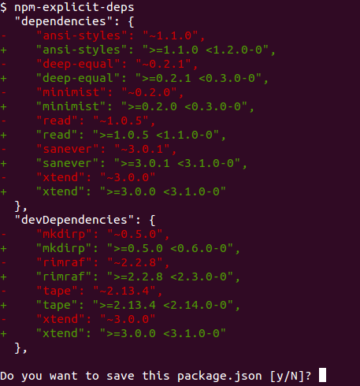
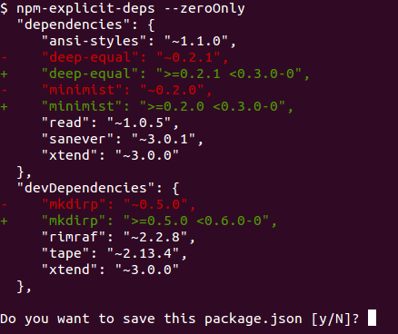

# npm-explicit-deps

**Say goodbye to fickle `^` and `~` semver ranges**

## Wut?

Uses **[sanever](https://github.com/rvagg/sanever)**, a fork of node-semver, to rewrite your package.json `"dependencies"` (and `"devDependencies"` etc.) to remove pesky `^` and `~` range specifiers leaving you with explicit ranges that are **obvious** in their intent and will have **stability** into the future (i.e. not relying on the meaning `^` and `~` being unchanging, because it hasn't been).

See [sanever](https://github.com/rvagg/sanever) for full details of the alternative interpretation of how ranges *should* work. The summary is:

 * **The `<1` ranges no longer have special meaning** for `^` (and `~` if ever changed by node-semver / npm). See [npm/node-semver#92](https://github.com/npm/node-semver/pull/92) for context. As of v2.0.0, according to npm's version of semver, a `^0.1.2` range expands to exactly one version, `0.1.2`, while `^1.2.3` expands to `>=1.2.3-0 <2.0.0-0`.
 * **pre-releases** are not included in the lower-end of an expanded range. e.g. `1.2.3-xyz` comes *before* `1.2.3`, therefore a `~1.2.3` *should not* include the pre-release `-xyz` version(s).

See rant below for more information about these changes.

Use your normal workflow to `npm install foo --save` (etc.) and your preferred `save-prefix` (default: `^`, or `~` if you `npm config set save-prefix '~'`) will be pre-pended to the latest version of that package. Then run `npm-explicit-deps` to fix the prefixed range to an explicit range using the adjusted rules outlined above. To upgrade a package to the latest version from npm, simply `npm install foo@latest --save` and run `npm-explicit-deps` again to re-fix.

## Examples

Or just fix up the `<1` ranges, which is where a lot of the trouble is.

## Usage

<b><code>npm-explicit-deps [--zeroOnly|-0] [--yes|-y]</code></b>

Without arguments, will parse your package.json and rewrite all your dependencies with explicit version ranges. You will be shown a diff and asked whether or not you want to save the changes.

* `--zeroOnly` (or `-0`) will only modify the ranges in the `<1` region, since these are the pesky ones with silly rules that you'll probably want to be explicit about.
* `--yes` (or `-y`) will not show you a diff and will save changes without prompting.

## Justification

### `<1` special case & subjectivity

node-semver and npm have absurd rules for `<1` ranges that don't apply elsewhere. The `<1` rules are informed by the [semver](http://semver.org/) spec for what a `0` major version means, which is equally absurd.

**A major version of `0` should not be a special case**. It should not indicate anything other than you have not introduced any breaking changes since you first released your package. The semver spec says this:

> Major version zero (0.y.z) is for initial development. Anything may change at any time. The public API should not be considered stable.

1. In practice, this is a **subjective** idea and is rarely (ever?) used properly. Two people's idea of *"initial development"* and *"stability"* will rarely align.
2. Why is this only for `0`, if we are introducing *"stability"* rules into our versioning, why does this only apply to `<1`? Many software projects go through periods of instability, generally around redevelopment or major refactoring and developers end up communicating this instability in alternative ways. In Node, we can publish with `--tag dev` (or some other tag) so they are not on the `latest` tag and therefore not automatically installed. Linux pioneered the idea of using even versions for stable and odd for unstable and Node.js itself currently uses this pattern. Some projects will include a [stability index](https://github.com/hughsk/stability-badges) to communicate stability measures to users. You should use alternative means to communicate your idea of what stability means and how that applies to your project *if you actually need it*.

In summary: `<1` as a special case is bogus and should be avoided. My preference is to start a packages at `1.0.0` to avoid this. You will soon be [able to](https://github.com/npm/npmconf/pull/38) `npm config set init.version 1.0.0` to automate this.

### `^` is dangerous

I strongly advise `npm config set save-prefix '~'` to completely avoid the use of the `^` range specifier.

1. It is incompatible with the version of npm released with Node 0.8. It was introduced part way through the 0.10 cycle so can break people depending on your library that can't upgrade Node.
2. It does not reflect the reality of how most Node.js developers use semver. This is largely due to our conditioning to `~` ranges where the minor version is all that matters and the major version is only useful for communicating some vague sense of "major upgrade" and nothing more. This is changing, but like all culture changes it will take a long time before a more strict interpretation of semver is being used by developers publishing to npm.
3. It's just bad practice! An `^` range will automatically include newer versions of dependencies to your library long after you've released it in a tested state. You should be exercising greater control over what dependencies are coupled with your libraries and applications or you're asking for trouble. Some Node.js developers go so far as to pin exact dependency versions and upgrade them explicitly. My current preference is to use the `~` range so that my libraries can take advantage of **patch** releases. I don't want to take the risk of including wildly changing versions of a dependency, even if the fact that the major version hasn't changed is *supposed* to mean that there are no breaking changes. I don't trust myself enough to do versioning properly and consistently over a long period of time so why would I trust anybody else?

For the record, I'm attempting to follow proper semver (minus the `<1` sillyness) these days. But I'm still not going to be using `^` or recommend that people feel safe doing that when depending on my libraries!

### Instability

The `^` and `~` range specifiers are [unstable](https://github.com/npm/node-semver/pull/92) and may change into the future; this is out of your control. It's much more difficult to change the meaning of an explicit version range.

## License

**npm-explicit-deps** is Copyright (c) 2014 Rod Vagg [@rvagg](https://twitter.com/rvagg) and contributors licensed under the MIT License. All rights not explicitly granted in the MIT License are reserved. See the included [LICENSE.md](./LICENSE.md) file for more details.
